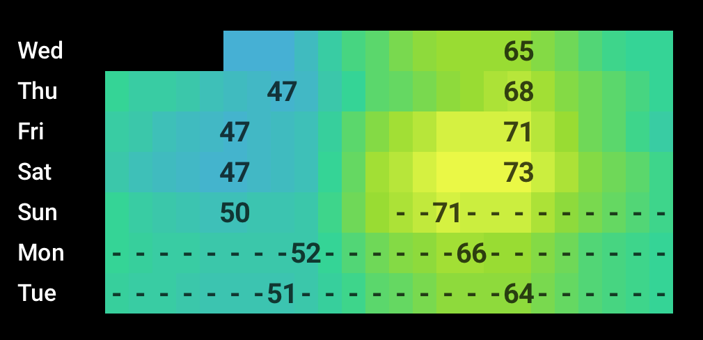

# Weather Mosaic Card

A custom [Home Assistant](https://www.home-assistant.io/) Lovelace card that displays a 7-day hourly weather forecast as a color-coded grid — one row per day, one cell per hour. Inspired by the periodic table, it takes advantage of the natural periodicity of daily weather cycles to let you spot temperature trends, hot afternoons, cool nights, and rainy periods at a glance.



---

## How It Works

Each cell represents one hour of one day. The cell color encodes temperature — cool blues on the left of the scale, through greens and yellows, to deep reds for extreme heat. Precipitation probability is shown as subtle markers within cells. Daily high and low temperatures are labeled directly on their peak cells.

---

## Installation

### HACS (Recommended)

1. Open HACS in Home Assistant
2. Go to **Frontend**
3. Click **Explore & Download Repositories**
4. Search for **Weather Mosaic Card**
5. Click **Download**
6. Restart Home Assistant

### Manual

1. Download `weather-mosaic-card.js` from the [latest release](../../releases/latest)
2. Copy it to `/config/www/weather-mosaic-card.js`
3. In Home Assistant go to **Settings → Dashboards → Resources**
4. Add a new resource:
   - URL: `/local/weather-mosaic-card.js`
   - Type: `JavaScript Module`
5. Restart Home Assistant

---

## Configuration

Add the card to your dashboard via the UI or YAML:

```yaml
type: custom:weather-mosaic-card
entity: weather.your_weather_entity
```

### Options

| Option | Type | Default | Description |
|--------|------|---------|-------------|
| `entity` | string | `weather.pirateweather` | Your weather entity ID |

---

## Color Scale

The temperature color scale is currently calibrated for **Fahrenheit**. Celsius support is planned for v0.2.0.

| Color | Temperature (°F) |
|-------|-----------------|
| 🔵 Light blue | Below 30° |
| 🔵 Blue | 30–40° |
| 🟢 Teal | 40–55° |
| 🟢 Green | 55–65° |
| 🟡 Yellow-green | 65–75° |
| 🟡 Yellow | 75–85° |
| 🟠 Orange | 85–95° |
| 🔴 Red | 95°+ |

---

## Precipitation Indicators

| Symbol | Meaning |
|--------|---------|
| `-` | 10–49% chance of precipitation |
| `/` | 50%+ chance of precipitation |

---

## Tested With

- [PirateWeather](https://pirateweather.net/)

*If you use this card with another weather integration, please open an issue or PR to add it to this list.*

---

## Roadmap

- [ ] Celsius / automatic unit detection
- [ ] Configurable number of days
- [ ] Configurable hour range
- [ ] Optional title
- [ ] Show/hide precipitation markers
- [ ] Custom color scale presets
- [ ] HACS default repository listing

---

## Contributing

Issues and pull requests are welcome! If you find a bug or have a feature request, please [open an issue](../../issues).

---

## License

MIT
