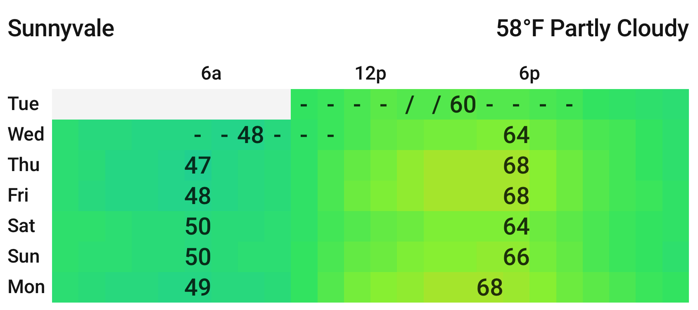
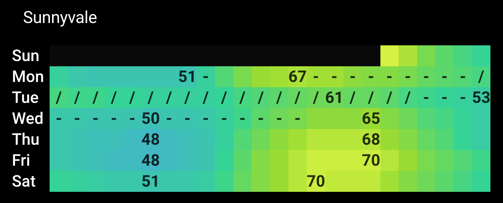

# Weather Mosaic Card

A custom [Home Assistant](https://www.home-assistant.io/) Lovelace card that displays a 7-day hourly weather forecast as a color-coded grid — one row per day, one cell per hour. Each cell's color encodes temperature, letting you spot daily patterns, hot afternoons, cool nights, and rainy periods at a glance.




---

## How It Works

Each cell represents one hour of one day. Cell color encodes temperature using your choice of color scale. Precipitation probability is shown as subtle markers within cells. Daily high and low temperatures are labeled directly on their peak cells. The card scales to fit any dashboard column width.

---

## Installation

### HACS (Recommended)

1. Open HACS in Home Assistant
2. Go to **Frontend**
3. Click **Explore & Download Repositories**
4. Search for **Weather Mosaic Card**
5. Click **Download**
6. Restart Home Assistant

### Manual

1. Download `weather-mosaic-card.js` from the [latest release](../../releases/latest)
2. Copy it to `/config/www/weather-mosaic-card.js`
3. In Home Assistant go to **Settings → Dashboards → Resources**
4. Add a new resource:
   - URL: `/local/weather-mosaic-card.js`
   - Type: `JavaScript Module`
5. Restart Home Assistant

---

## Weather Integrations

This card requires a Home Assistant weather entity that provides **hourly** forecast data. If you don't have one set up yet, here are the easiest options:

| Integration | Cost | Coverage | Notes |
|-------------|------|----------|-------|
| [Open-Meteo](https://www.home-assistant.io/integrations/open_meteo/) | Free, no account | Global | Built into HA — just add the integration and pick your location. Easiest starting point. |
| [PirateWeather](https://pirateweather.net/) | Free tier available | Global | Requires a free API key. Closely mirrors the Dark Sky API. |
| [National Weather Service](https://www.home-assistant.io/integrations/nws/) | Free, no account | US only | Built into HA. Good choice if you're in the US and prefer an official government source. |

Once your integration is set up, HA will create a `weather.` entity you can point this card at.

---

## Configuration

The card supports a visual editor — click the card in the dashboard editor to configure it. All options are also available via YAML:

```yaml
type: custom:weather-mosaic-card
entity: weather.your_weather_entity
```

### Visual Editor Options

These options are available in the card's visual editor:

| Option | Type | Default | Description |
|--------|------|---------|-------------|
| `entity` | string | `weather.pirateweather` | Weather entity ID (must provide hourly forecast) |
| `title` | string | Derived from entity name | Card title. Set to empty string to hide. |
| `temperature_unit` | `F` \| `C` | `F` | Unit for displayed temperature labels |
| `days` | 1–7 | `7` | Number of days to display |
| `show_current` | boolean | `true` | Show current temperature and conditions in the header |
| `show_minmax` | boolean | `true` | Show daily high and low temperature labels |
| `show_precip` | boolean | `true` | Show precipitation symbols |

### Advanced YAML Options

These options are not shown in the visual editor but can be set in YAML:

| Option | Type | Default | Description |
|--------|------|---------|-------------|
| `color_scale` | `mosaic` \| `blue_red` \| `turbo` | `mosaic` | Color scale used to encode temperature |
| `hours` | `above` \| `below` | *(hidden)* | Show hour labels above or below the grid |
| `time_format` | `12` \| `24` | `24` | Format for hour labels (3a/6p vs 3/15) |
| `font_scale` | number | `1.0` | Multiplier for font size. `1.2` = 20% larger, `0.8` = 20% smaller. |
| `timezone` | string | Auto-detected | IANA timezone for the forecast location (e.g. `America/New_York`). Auto-detected from the entity's `timezone` attribute if present, otherwise uses local browser time. |

### Full Example

```yaml
type: custom:weather-mosaic-card
entity: weather.pirateweather
title: My Weather
temperature_unit: F
days: 7
show_current: true
show_minmax: true
show_precip: true
color_scale: turbo
hours: above
time_format: 12
font_scale: 1.0
timezone: America/New_York
```

---

## Color Scales

| Scale | Description |
|-------|-------------|
| `mosaic` | Multi-color scale: blue → teal → green → yellow → orange → red |
| `blue_red` | Clean diverging scale: blue (cold) → red (hot) |
| `turbo` | Perceptually uniform: blue → green → yellow → red |

All scales are calibrated for temperatures in °F. When `temperature_unit: C` is set, displayed labels are converted but the color mapping remains °F-based — set your HA weather integration to report in °F for best results.

---

## Precipitation Indicators

| Symbol | Meaning |
|--------|---------|
| `-` | 10–49% chance of precipitation |
| `/` | 50%+ chance of rain |
| `*` | 50%+ chance of snow |

Set `show_precip: false` to hide these markers.

---

## Tested With

- [PirateWeather](https://pirateweather.net/)
- [Open-Meteo](https://www.home-assistant.io/integrations/open_meteo/)

*Using this card with another integration? Open an issue or PR to add it to this list.*

---

## Contributing

Issues and pull requests are welcome. If you find a bug or have a feature request, please [open an issue](../../issues).

---

## License

MIT
