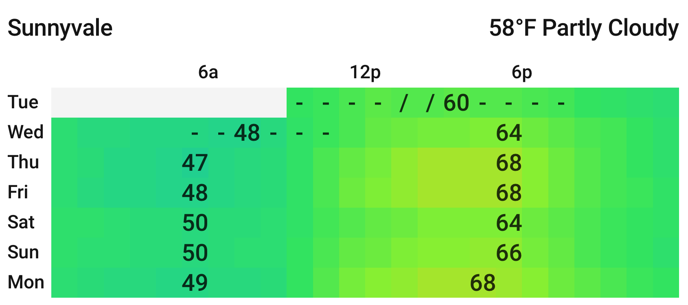
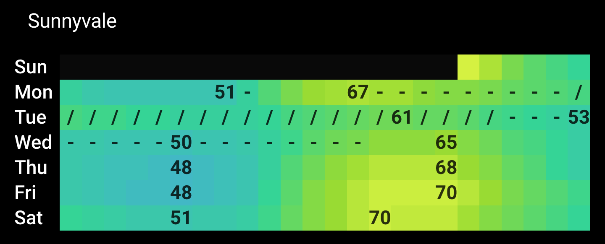

<p align="center">
  
</p>

<p align="center">
  <a href="https://github.com/hacs/default"></a>
  <a href="https://github.com/whalleyms/weather-mosaic-card/releases"></a>
  <a href="https://github.com/whalleyms/weather-mosaic-card/releases"></a>
  <a href="https://github.com/whalleyms/weather-mosaic-card/actions/workflows/validate.yml"></a>
  <a href="https://github.com/whalleyms/weather-mosaic-card/blob/main/LICENSE"></a>
</p>

A custom [Home Assistant](https://www.home-assistant.io/) dashboard card that displays a 7-day hourly weather forecast as a color-coded grid — one row per day, one cell per hour. Each cell's color encodes temperature, letting you spot daily patterns, hot afternoons, cool nights, and rainy periods at a glance.

**[Preview →](https://whalleyms.github.io/weather-mosaic-card/)**




---

## Design

Most weather displays are cluttered — icons, numbers, labels, legends competing for attention. This card takes a different approach: encode everything into color and let the eye do the work.

The complete 7-day hourly forecast fits in a single glance. This is possible because daily temperatures follow a strongly predictable diurnal cycle — cool before dawn, warming through the morning, peaking mid-afternoon, falling through the evening — and that rhythm maps naturally onto the grid. But the display also captures multi-day patterns: heat waves appear as broad warm patches, cold fronts as abrupt color shifts, rainy stretches as clusters of precipitation markers spanning several rows. Your mind quickly adapts to these patterns, enabling you to read a week of weather in one eyespan.

The design is inspired by Edward Tufte's principle of maximizing the data-to-ink ratio: show as much information as possible with as little visual noise as possible. It has been refined over several years, first as a [MagicMirror](https://magicmirror.builders/) module and now as a Home Assistant card. It works especially well as a kiosk or always-on display where you want to glance at the forecast without having to physically interact.

## How It Works

Each cell represents one hour of one day. Cell color encodes temperature using your choice of color scale. Precipitation probability is shown as subtle markers within cells. Daily high and low temperatures are labeled directly on their peak cells. The card scales to fit any dashboard column width.

Prefer a radial view? The [Spiral Layout](#spiral-layout) winds the same forecast into a spiral that gives near-term hours more space than distant ones — encoding forecast confidence as screen space.

---

## Installation

<a href="https://my.home-assistant.io/redirect/hacs_repository/?owner=whalleyms&repository=weather-mosaic-card&category=plugin">
  
</a>

### HACS (Recommended)

Weather Mosaic Card is in the default HACS store — no need to add it as a custom repository.

1. Open **HACS** in Home Assistant
2. Search for **Weather Mosaic Card**
3. Open it and click **Download**
4. Restart Home Assistant

Or click the **Open in HACS** badge above to jump straight to it.

### Manual

1. Download `weather-mosaic-card.js` from the [latest release](../../releases/latest)
2. Copy it to `/config/www/weather-mosaic-card.js`
3. In Home Assistant go to **Settings → Dashboards → Resources**
4. Add a new resource:
   - URL: `/local/weather-mosaic-card.js`
   - Type: `JavaScript Module`
5. Restart Home Assistant

---

## Weather Integrations

This card requires a Home Assistant weather entity that provides **hourly** forecast data. If you don't have one set up yet, here are the easiest options:

| Integration | Cost | Coverage | Notes |
|-------------|------|----------|-------|
| [Open-Meteo](https://www.home-assistant.io/integrations/open_meteo/) | Free, no account | Global | Built into HA — just add the integration and pick your location. Easiest starting point. |
| [PirateWeather](https://pirateweather.net/) | Free tier available | Global | Requires a free API key. Closely mirrors the Dark Sky API. |
| [National Weather Service](https://www.home-assistant.io/integrations/nws/) | Free, no account | US only | Built into HA. Good choice if you're in the US and prefer an official government source. |

Once your integration is set up, HA will create a `weather.` entity you can point this card at.

---

## Configuration

The card supports a visual editor — click the card in the dashboard editor to configure it. All options are also available via YAML:

```yaml
type: custom:weather-mosaic-card
entity: weather.your_weather_entity
```

### Visual Editor Options

These options are available in the card's visual editor:

| Option | Type | Default | Description |
|--------|------|---------|-------------|
| `entity` | string | `weather.pirateweather` | Weather entity ID (must provide hourly forecast) |
| `temperature_entity` | string | _(unset)_ | Optional sensor that overrides the header's current temperature (e.g. a local/personal weather station). Leave unset to read the temperature from the weather entity. |
| `title` | string | Derived from entity name | Card title. Set to empty string to hide. |
| `temperature_unit` | `F` \| `C` | `F` | Unit for displayed temperature labels |
| `layout` | `grid` \| `spiral` | `grid` | `grid` draws one row per day. `spiral` wraps each day into a full 360° turn, winding inward into the future. See [Spiral Layout](#spiral-layout). |
| `days` | 1–7 | `7` | Number of days to display |
| `show_current` | boolean | `true` | Show current temperature and conditions in the header |
| `show_minmax` | boolean | `true` | Show daily high and low temperature labels |
| `show_precip` | boolean | `true` | Show precipitation symbols |
| `color_scale` | `mosaic` \| `blue_red` \| `turbo` \| `viridis` \| `inferno` \| `white_hot` \| `black_hot` | `mosaic` | Color scale used to encode temperature |
| `sun_gaps` | boolean | `false` | Mark **sunrise and sunset** as thin vertical gaps on the grid, bracketing the daytime hours. See [Sunrise & Sunset Markers](#sunrise--sunset-markers). |

### Advanced YAML Options

These options are not shown in the visual editor but can be set in YAML:

| Option | Type | Default | Description |
|--------|------|---------|-------------|
| `hours` | `above` \| `below` \| `none` | `above` | Hour labels: above the grid, below it, or `none` to hide them entirely. In the spiral layout the labels always ring the outside, so `above` and `below` behave identically there and `none` hides them. |
| `time_format` | `12` \| `24` | `12` | Format for hour labels (3a/6p vs 3/15) |
| `font_scale` | number | `1.0` | Multiplier for font size. `1.2` = 20% larger, `0.8` = 20% smaller. |
| `timezone` | string | Auto-detected | IANA timezone for the forecast location (e.g. `America/New_York`). Auto-detected from the entity's `timezone` attribute if present, otherwise uses local browser time. |
| `spiral_gap` | number | `1` | _(Spiral layout only)_ Thickness of the gap between spiral turns, as a multiple of the default. `0` removes it (turns abut into a solid disk); `2` doubles it. |
| `latitude` / `longitude` | number | _(HA location)_ | _(with `sun_gaps`)_ Coordinates used to compute sunrise/sunset. Defaults to your Home Assistant location; set both for a card showing a different place. |
| `sun_gap_width` | number | `2` | _(with `sun_gaps`)_ Width in pixels of the sunrise/sunset gaps. |
| `sunrise` / `sunset` | 0–23 | _(computed)_ | _(with `sun_gaps`)_ Force the sunrise/sunset hour directly, bypassing the coordinate calculation. Rarely needed. |
| `custom_color_scale` | list | _(unset)_ | Define your own temperature→color stops, overriding `color_scale`. See [Custom Color Scale](#custom-color-scale). |
| `precipitation_symbols` | list | _(unset)_ | Define your own precipitation markers and the conditions they appear under. See [Custom Precipitation Symbols](#custom-precipitation-symbols). |

### Full Example

```yaml
type: custom:weather-mosaic-card
entity: weather.pirateweather
title: My Weather
temperature_unit: F
days: 7
show_current: true
show_minmax: true
show_precip: true
color_scale: turbo
hours: above
time_format: 12
font_scale: 1.0
timezone: America/New_York
```

---

## Local Temperature Override

By default the header's current temperature comes from the weather entity. If you have a more accurate local source — a personal weather station, an outdoor sensor, or a hyperlocal helper — point `temperature_entity` at it:

```yaml
type: custom:weather-mosaic-card
entity: weather.home
temperature_entity: sensor.outdoor_temperature
```

The header then shows that sensor's reading, followed by the current condition from the weather entity. The sensor's own `unit_of_measurement` is respected, so a °C sensor is converted to match `temperature_unit`. The forecast grid is unaffected — it always uses the weather entity's hourly data. Leaving `temperature_entity` unset keeps the original behaviour.

---

## Spiral Layout

Set `layout: spiral` to wrap the same forecast into a spiral instead of a grid:

```yaml
type: custom:weather-mosaic-card
entity: weather.home
layout: spiral
```


**Why a spiral?** A forecast is most trustworthy right now and least trustworthy a week out — but a grid gives every hour the same amount of space, quietly implying every hour is equally certain. The spiral encodes that confidence as screen real estate. It begins at the current hour on the outer edge, where the turns are longest and each hour gets the most room, and winds **inward into the future**, where the turns grow shorter and each day takes up steadily less area. How much of the display a moment occupies scales with how much you can trust it: the near term is large and prominent, the far edge of the forecast small and quiet.

**How to read it.** One full turn is one 24-hour day. Because a turn is exactly 24 hours, every hour always lands at the same angle — **midnight is at 12 o'clock** — so the same hour on successive days lines up radially, the polar equivalent of the grid's columns. The spiral starts at *now* (a small step in the outer edge marks the current time), so no space is wasted on hours that have already passed. The **current temperature sits in the center**, the even hours are labelled around the rim as a 24-hour clock (24 at the top), and two-letter day names run down from midnight.

Everything else works exactly as it does in the grid — color scales, `custom_color_scale`, precipitation symbols, min/max labels, `days`, and `font_scale` all apply unchanged. The thin gap between turns is adjustable with [`spiral_gap`](#advanced-yaml-options) (set it to `0` for a solid disk).

> **Sizing:** the spiral is square, so give the card more height than the wide grid needs. In a sections dashboard it claims a taller footprint automatically; in a masonry dashboard it renders as a tall card.

---

## Sunrise & Sunset Markers

Turn on **`sun_gaps`** (a switch in the visual editor) to mark **sunrise and sunset** as thin vertical gaps on the grid:

```yaml
type: custom:weather-mosaic-card
entity: weather.home
sun_gaps: true
```

On the grid, a gap opens at the sunrise column and another at the sunset column, so the daytime hours are visibly bracketed off from the night — a narrow band in winter, wide in summer. On the **spiral layout** the same markers appear as radial gaps at the sunrise and sunset angles, separating the daytime arc from the night arc.

When the hour labels are shown, the **exact sunrise and sunset times** are printed at the gaps (in the same 12- or 24-hour style as the hour labels), replacing any hour label they would overlap.

Sunrise and sunset are **computed from the location's coordinates and today's date**, rounded to the nearest hour. A card for your **home location needs no setup** — it uses your Home Assistant coordinates automatically. For a card showing **another location**, give it that place's `latitude` / `longitude` (plus its `timezone`, which the card already needs for the hour labels) — a one-time geographic fact, with no seasonal upkeep. The gap width is adjustable with `sun_gap_width` (pixels, default 2).

> **Remote cards:** if you set a `timezone` different from your Home Assistant instance's, you **must also set `latitude`/`longitude`**. The card won't fall back to your home coordinates there (that would place the sun at the wrong city) — so without them, no sun markers appear.

> Works on both the grid and the spiral. Everything else — color scales, precipitation symbols, min/max labels — is unchanged.

---

## Color Scales

| Scale | Description |
|-------|-------------|
| `mosaic` | Multi-color scale: blue → teal → green → yellow → orange → red |
| `blue_red` | Clean diverging scale: blue (cold) → red (hot) |
| `turbo` | Perceptually uniform: blue → green → yellow → red |
| `viridis` | Colorblind-safe: dark purple → teal → green → yellow |
| `inferno` | High contrast, dark theme-friendly: black → purple → red → orange → yellow |
| `white_hot` | Thermal grayscale: coldest = black → hottest = white |
| `black_hot` | Inverted thermal grayscale: coldest = white → hottest = black |

All scales are calibrated for temperatures in °F. When `temperature_unit: C` is set, displayed labels are converted but the color mapping remains °F-based — set your HA weather integration to report in °F for best results.

---

## Custom Color Scale

Not happy with the built-in scales? Define your own with the advanced `custom_color_scale` option (YAML only — it isn't in the visual editor). It takes a list of `[temperature, color]` stops, and the card interpolates between them exactly like a built-in scale. Colors may be hex strings or `[r, g, b]` arrays:

```yaml
type: custom:weather-mosaic-card
entity: weather.home
custom_color_scale:
  - [30, "#2b83ba"]        # hex
  - [50, "#abdda4"]
  - [70, "#ffffbf"]
  - [90, [215, 25, 28]]    # or [r, g, b]
```

- You need at least **two** stops. Order doesn't matter — stops are sorted automatically.
- Temperatures below your lowest stop take its color; above your highest, its color (no extrapolation).
- When set, `custom_color_scale` **overrides** the named `color_scale`. If it's missing or malformed, the card silently falls back to `color_scale` (or `mosaic`).
- Stops are matched against the same temperature values the built-in scales use, so define them in the unit your weather entity reports (°F for most US integrations).

---

## Precipitation Indicators

| Symbol | Meaning |
|--------|---------|
| `-` | 10–49% chance of precipitation |
| `/` | 50%+ chance of rain |
| `*` | 50%+ chance of snow |

Set `show_precip: false` to hide these markers.

### Custom Precipitation Symbols

The markers above are the default. To choose your own symbols and your own probability levels, use the advanced `precipitation_symbols` option (YAML only, not in the visual editor). It's an ordered list of rules; for each cell the card walks the list top to bottom and uses the **first rule that matches**. A cell that matches nothing shows no marker.

This example reproduces the exact default behavior — a good starting point to copy and tweak:

```yaml
precipitation_symbols:
  - symbol: "*"          # 50%+ chance and snowing
    condition: snow
    min_probability: 50
  - symbol: "/"          # 50%+ chance (rain)
    min_probability: 50
  - symbol: "-"          # 10–49% chance
    min_probability: 10
```

Each rule needs a `symbol`; the other fields are optional gates (a rule matches only when **all** of its gates pass):

| Field | Meaning |
|-------|---------|
| `symbol` | The text to show in the cell (required). |
| `min_probability` | Minimum precipitation probability, in percent. Omit to match any probability. |
| `condition` | Matches only when the weather entity's state contains this text (e.g. `snow`, `rain`). Omit to ignore the condition. |

Since rules are matched top to bottom, list your higher-probability levels first. Set your own thresholds and symbols — for example, three probability bands with no rain/snow split:

```yaml
precipitation_symbols:
  - symbol: "#"          # 70%+ chance
    min_probability: 70
  - symbol: "="          # 40–69%
    min_probability: 40
  - symbol: "."          # 15–39%
    min_probability: 15
```

Leave `precipitation_symbols` unset to keep the default markers. `show_precip: false` still hides everything.

---

## Tested With

- [PirateWeather](https://pirateweather.net/)
- [Open-Meteo](https://www.home-assistant.io/integrations/open_meteo/)
- [National Weather Service](https://www.home-assistant.io/integrations/nws/)

*Using this card with another integration? Open an issue or PR to add it to this list.*

---

## Contributing

Issues and pull requests are welcome. If you find a bug or have a feature request, please [open an issue](../../issues).

---

## License

MIT

